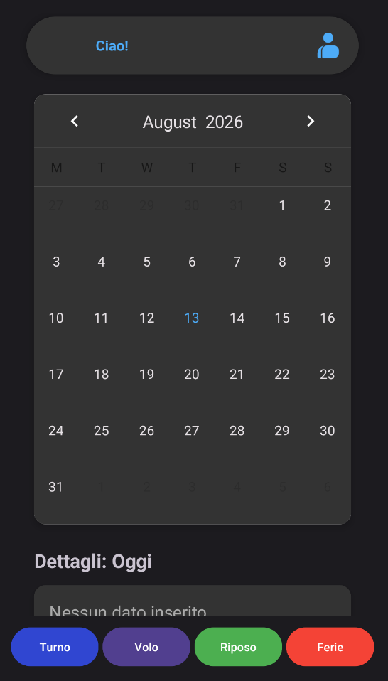
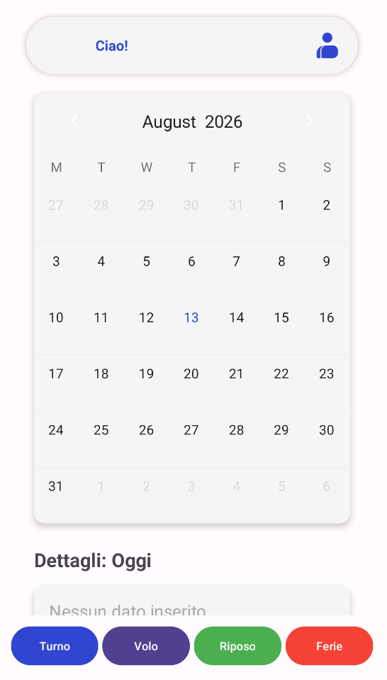

  

<h1 align="center">AgentShifts</h1>

  

 

  
  &nbsp;&nbsp;&nbsp;&nbsp;
  

---

Un'applicazione Android sviluppata in Java per gestire in maniera semplice e intuitiva i propri turni di lavoro, voli giornalieri e giorni di riposo.

## Funzionalità

* **Calendario Interattivo:** Naviga tra i mesi e gestisci i tuoi impegni con un'interfaccia fluida.
* **Gestione Turni e Voli:** Aggiungi, modifica e tieni traccia di turni, voli e giorni di riposo.
* **UI/UX Moderna:** Interfaccia pulita.
* **Tema Dinamico:** Supporto completo alla **Modalità Chiara e Scura** di sistema.

## Tecnologie Utilizzate

* **Linguaggio:** Java
* **UI:** XML, Componenti Material Design 3
* **Librerie Esterne:** [Material-Calendar-View](https://github.com/Applandeo/Material-Calendar-View) (Applandeo)
* **IDE:** Android Studio

## Download & Installazione

Puoi testare l'app direttamente sul tuo telefono Android!

1. Vai alla pagina [Releases](../../releases) di questo repository.
2. Scarica il file `.apk` più recente.
3. Apri il file scaricato sul tuo dispositivo Android e tocca **Installa**.
*(Nota: potrebbe essere necessario abilitare "Installa app sconosciute" nelle impostazioni del tuo telefono).*

---

## Autore

**Francesco Massimo Capobianco**
* GitHub: [@FrancescoCapobianco](https://github.com/FrancescoCapobianco)
